# 🌦️ Mini Weather & Safety Station  

An embedded system project using **STM32F103C8T6** to monitor environmental conditions and provide **real-time safety alerts**.  

---

## 🚀 Features
- 🌡️ Reads **temperature & humidity** using DHT11  
- 💧 Monitors **soil moisture** with YL-69 sensor  
- 👀 Detects **motion** using IR sensor  
- 📟 Displays real-time readings on **0.96” OLED**  
- 🔴🟡🟢 LED indicators show **Safe / Warning / Critical** status  
- 🔔 **Buzzer alerts** in emergency conditions  
- ⚡ Threshold-based warnings:  
  - High temperature  
  - Extreme humidity  
  - Low soil moisture  
  - Unsafe motion detComponents
## 🛠️ Components Used
| Component | Purpose | Image |
|-----------|---------|-------|
| **STM32F103C8T6** | Main microcontroller | 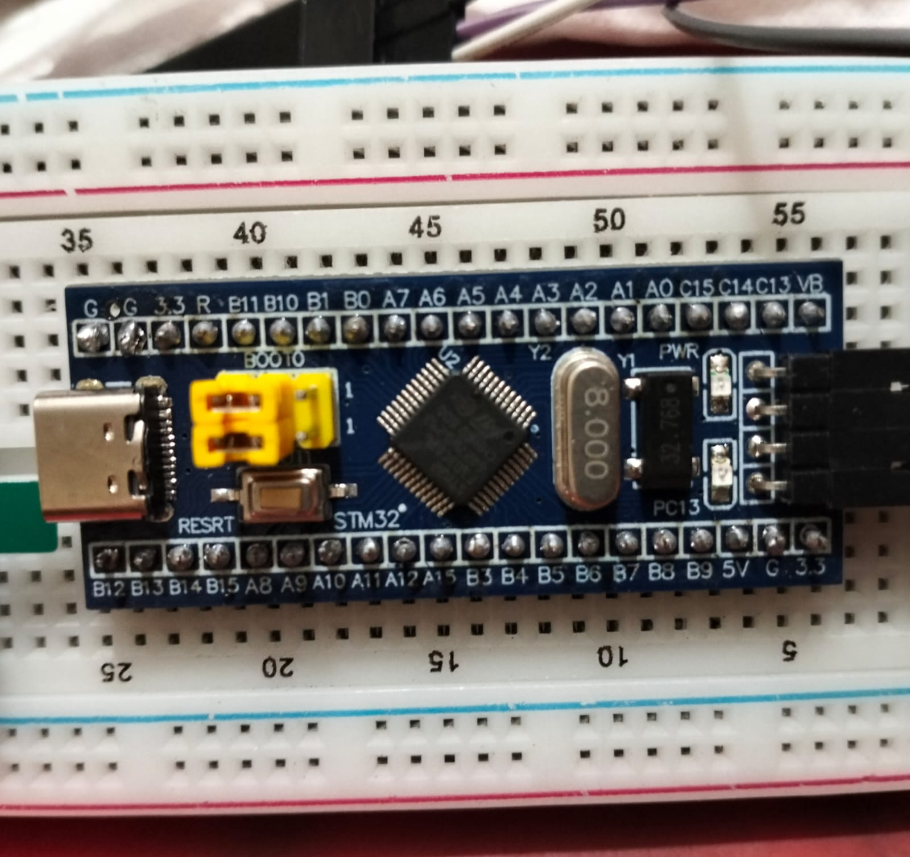 |
| **ST-LINK V2** | Programmer/debugger for STM32 | 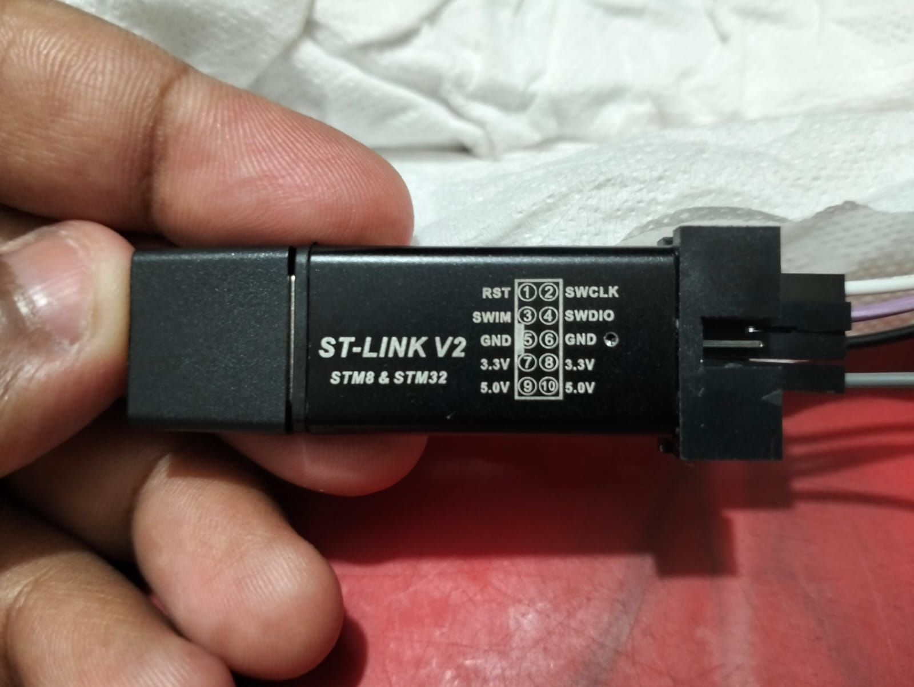 |
| **DHT11** | Temperature & Humidity sensor | 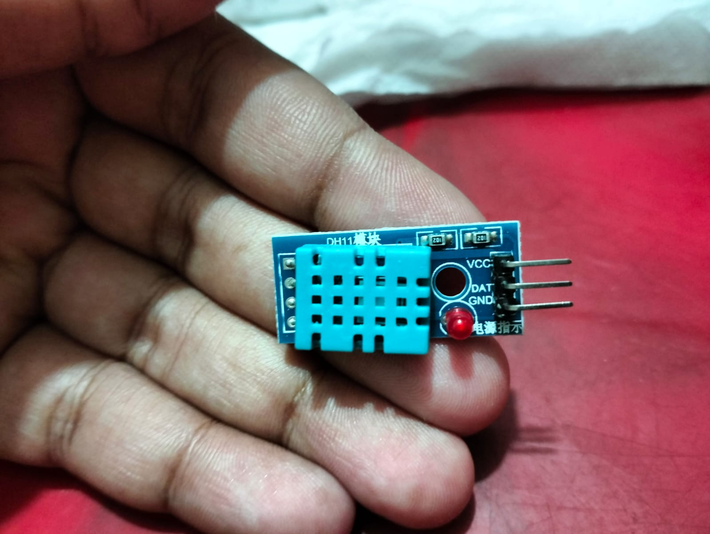 |
| **Soil Moisture Sensor (YL-69)** | Soil wetness measurement | 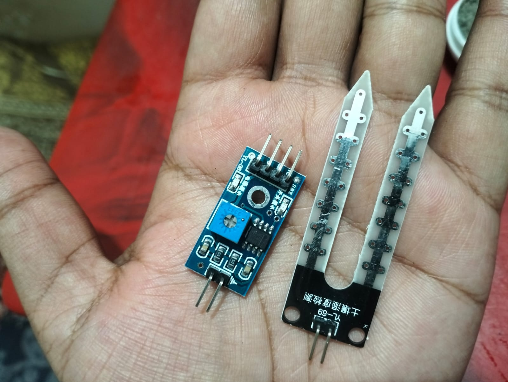 |
| **IR Sensor** | Motion detection | 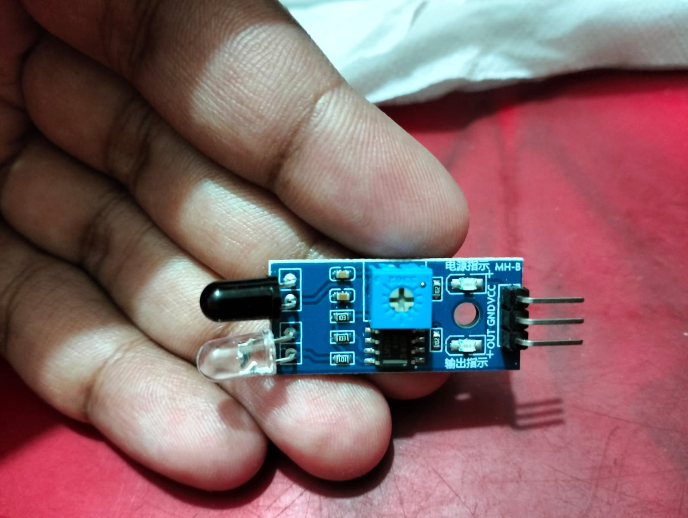 |
| **0.96” OLED** | Display readings | 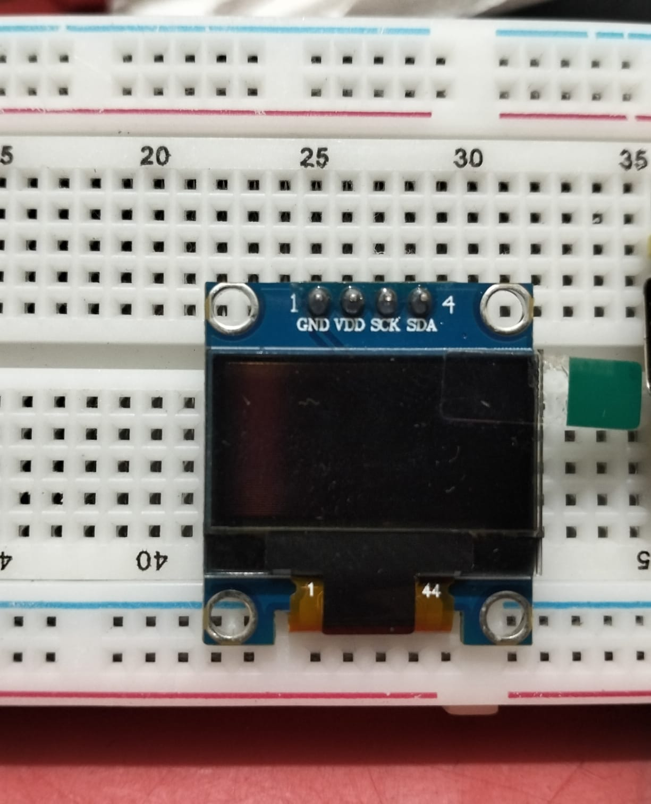 |
| **LEDs (Green, Yellow, Red)** | Status indication | 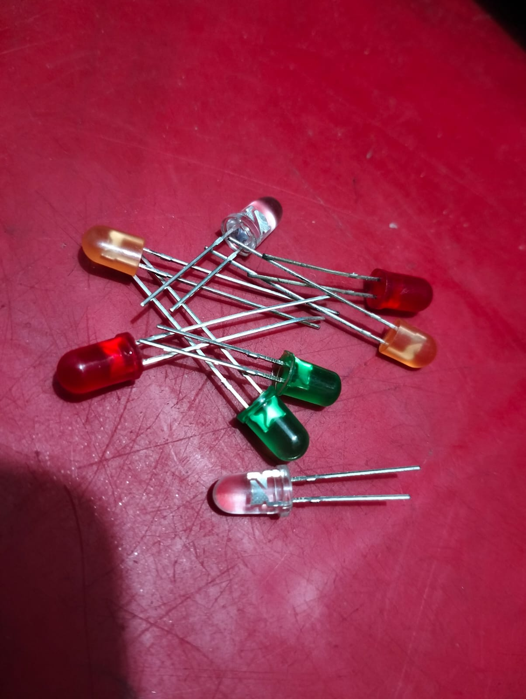 |
| **Buzzer** | Emergency alerts | 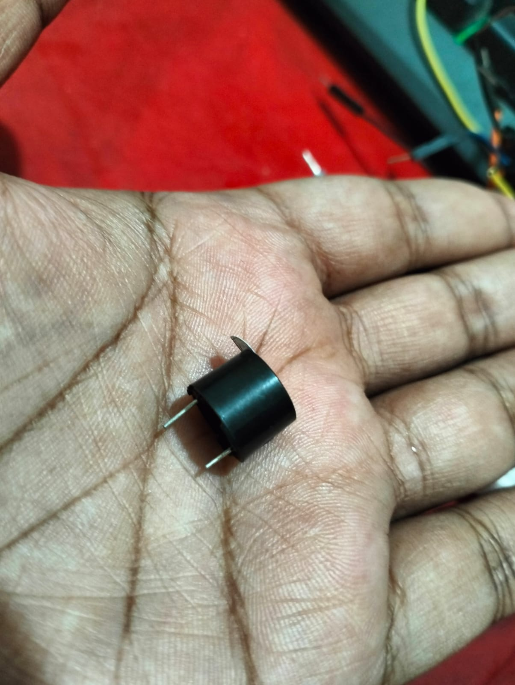 |

*(Add your component pictures in a folder named `component_pics/` and they will show up automatically)*  

---

## ⚙️ Installation & Setup  

### 1. Install STM32CubeIDE
- Download **[STM32CubeIDE](https://www.st.com/en/development-tools/stm32cubeide.html)**  
- Install the IDE for your OS (Windows)  
- INSTALL KEIL 
- For install watch this videos **[WATCH THIS VIDEO](https://www.youtube.com/watch?v=P0Tig56y6PA)**

### 2. PIN DIAGRAM
| **Pin DIagram** | Connections | 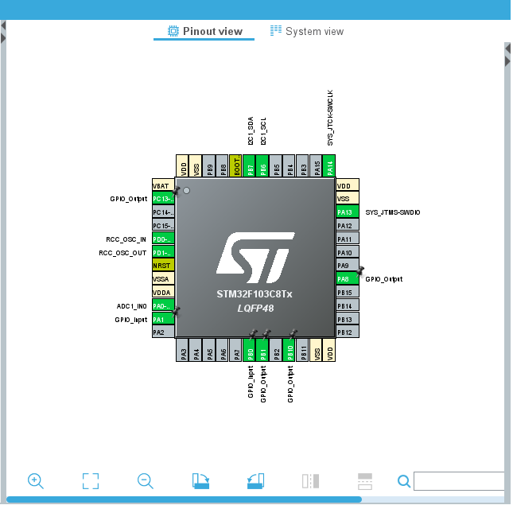 |

### 3. Install Drivers
- Install **ST-LINK V2 drivers** for your system  
- Connect STM32 board via USB  

### 4. Create Project in STM32CubeIDE
- Open STM32CubeIDE → New STM32 Project  
- Select **STM32F103C8T6** (BluePill board)  
- Configure peripherals:  
  - GPIO (LEDs, Buzzer, IR sensor, Soil sensor)  
  - I2C (for OLED)  
  - DHT11 (GPIO input)  

---
### PROJECT OVER VIEW
| **PROJECT** | VIEW | 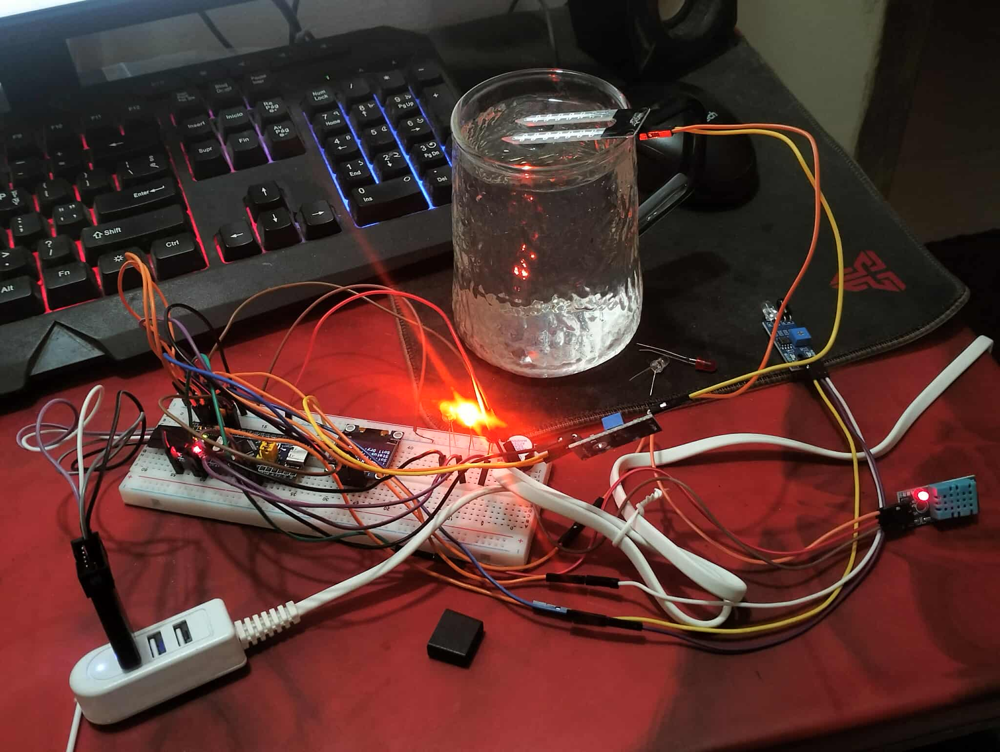 |
| **PROJECT** | VIEW | 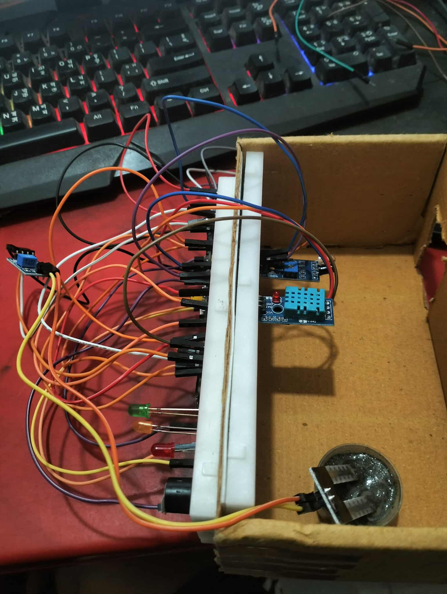 |

## ▶️ How to Run  

1. **Connect hardware**:  
   - Attach sensors (DHT11, YL-69, IR)  
   - Connect OLED via I2C  
   - LEDs & buzzer via GPIO pins  

2. **Flash the code**:  
   - Build project in STM32CubeIDE  
   - Flash via **ST-LINK V2**  

3. **Start Monitoring**:  
   - Power the STM32 board  
   - OLED will show real-time values  
   - LEDs & buzzer will respond based on thresholds  

---

## 📊 Sample Output  

| Temp | Humidity | Soil Moisture | Motion | OLED Output | LED | Buzzer |
|------|----------|---------------|--------|-------------|-----|--------|
| 29°C | 55% | 40% | Yes | TEMP:29 HUM:55 / SOIL: OK / SAFE | 🟢 Green | OFF |
| 33°C | 70% | 20% | Yes | WARNING: SOIL DRY / HIGH TEMP | 🔴 Red | ON |
| 32°C | 60% | 30% | No | TEMP:32 HUM:60 / SOIL: LOW / CAUTION | 🟡 Yellow | OFF |

---

### PROJECT PROPOSAL AND LAB REPORT
|**PROPOSAL** | VIEW | |
|**LAB REPORT** | VIEW | |

## 👥 Team Members
- **Arpo Roy** (2212656042)  
- **Anindita Das Mishi** (2211364642)  
- **Syed Tashriful Alam** (2212623042)  
- **Avik Sarker Dipu** (2111532042)  
- **Riazul Zannat** (2211199042)  

 

---

## 📌 Course Info
**CSE331L: Microprocessor Interfacing and Embedded System Lab**  
North South University – Summer 2025  
Instructor: *Sheikh Mohammed Wali Ullah*  

---